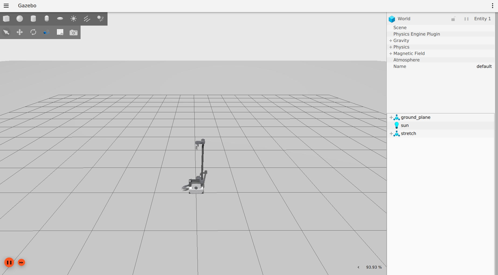

# Stretch Docker Documentation for ROS World Workshop

Welcome to our ROS World Workshop! This README is a documentation to go through installation steps to install docker and setup your docker environment for Stretch.

## Installation (Linux)

### Prerequisites

#### Install Docker

Install docker, following the [official installation steps](https://docs.docker.com/engine/install/ubuntu/#install-using-the-repository) and verify your installation.

#### Docker post-install steps

Follow the [official post-installation steps](https://docs.docker.com/engine/install/linux-postinstall/#manage-docker-as-a-non-root-user) for Linux allow non-root users to manage dockers and verify your post installation.

#### Install nvidia-docker2 (Skip if you don't have an nvidia gpu)

Follow the [official instructions](https://docs.nvidia.com/datacenter/cloud-native/container-toolkit/install-guide.html#installing-on-ubuntu-and-debian) install nvidia-docker2 and verify your installation.

### Getting Started with Stretch Docker

We provide a pre-built docker image and a set of scripts to easily get you up and running with Strectch on dockers! To get your docker running with UI and networking enabled:

1\. Fetch our start_docker script

```bash
wget https://raw.githubusercontent.com/vatanaksoytezer/stretch_ros/pr-docker/docker/scripts/start_docker.sh
```

2\. Start your container from our pre-built image

with an nvidia-gpu:

```bash
chmod +x start_docker.sh && \
./start_docker.sh stretch_roscon ghcr.io/vatanaksoytezer/stretch:roscon
```

without an nvidia-gpu:

```bash
chmod +x start_docker.sh && \
./start_docker.sh stretch_roscon ghcr.io/vatanaksoytezer/stretch:roscon nogpu
```

To open multiple terminals, you can just `./start_docker.sh stretch_roscon` from now on since the docker container is already constructed from the image with the command above.

3\. At this point you should be seeing a terminal window with all the necessary source code pre-built for you. 

Now you can test your Stretch docker by bringing up Stretch in Ignition Gazebo by issuing the following set of commands inside your container:

```bash
source /opt/ros/galactic/setup.bash && \
source /root/ws_stretch/install/setup.bash && \
export IGN_GAZEBO_RESOURCE_PATH="/root/ws_stretch/src/stretch_ros:/root/ws_stretch/src/realsense-ros:/root/ws_stretch/src/aws-robomaker-small-house-world/models" && \
ros2 launch stretch_ignition ignition.launch.py
```

Congragulations! You brought up Stretch in Ignition Gazebo! Now you should be seeing Stretch in Ignition Gazebo with an empty world around it:


### Building the docker image from scratch

## Installation (Windows)

### Prerequisites

#### Install WSL2 and Docker

## Installation (MacOS)

## Editing the source code during the Workshop

Our docker image comes with a pre-built installation of VS Code, vim and nano. You can also install your editor of choice via apt-get.
